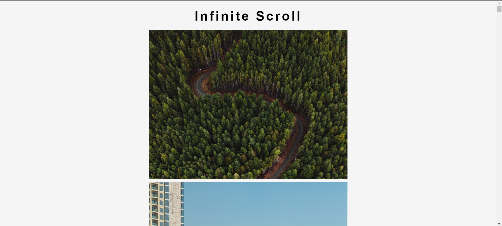

# Infinite Scroll

Infinite Scroll is a web application that allows users to load and view an endless stream of images from the Unsplash API. As the user scrolls down, more images are fetched and displayed, creating a seamless and visually appealing browsing experience.

## Features

- Infinite scrolling functionality to load more images seamlessly.
- Fetches random images from the Unsplash API.
- Displays image details (title and description).
- Provides links to the original Unsplash image pages.
- Responsive design for optimal viewing on different screen sizes.

## Technologies Used

- HTML5
- CSS3
- JavaScript
- Unsplash API

## Technical Details

### Unsplash API Integration

The application uses the Unsplash API to fetch random images. The API request is made with the following parameters:

- `client_id`: The API key provided by Unsplash for authentication.
- `count`: The number of images to fetch in a single request. In this application, it is set to `30`.

The API URL used is: `https://api.unsplash.com/photos/random/?client_id=${apiKey}&count=${count}`

### Infinite Scrolling

The infinite scrolling functionality is implemented using the `scroll` event listener on the `window` object. When the user scrolls near the bottom of the page, a new set of images is fetched from the Unsplash API and appended to the existing image container.

### Image Loading

To ensure a smooth user experience, the application uses an image loading indicator. When the initial set of images is being loaded, a loader is displayed. As each image finishes loading, a counter is incremented. Once all images have finished loading, the loader is hidden.

## Usage

1. Clone the repository or download the source code.
2. Open the `index.html` file in a web browser.
3. The application will load the initial set of images.
4. Scroll down to the bottom of the page to trigger the loading of additional images.
5. Click on an image to open the corresponding Unsplash page in a new tab.

## Acknowledgments

- [Unsplash](https://unsplash.com/) for providing the free image API.
- [Google Fonts](https://fonts.google.com/) for the beautiful font used in the application.
